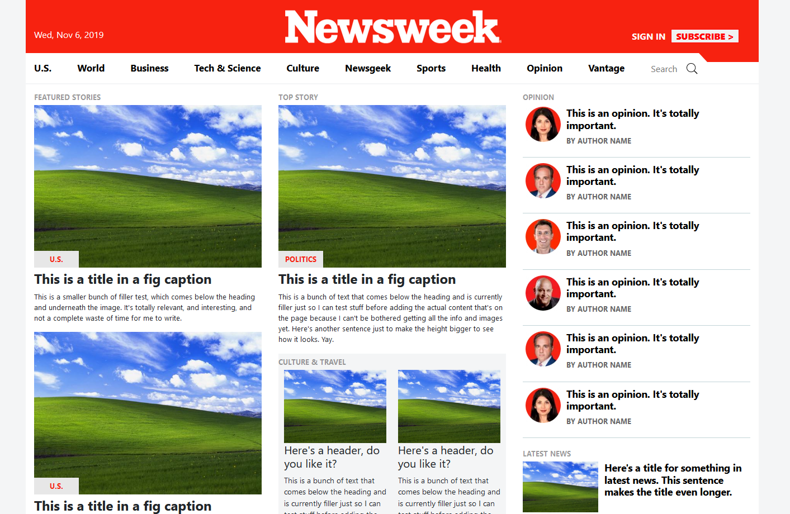

# Newsweek Homepage Clone
## Table Of Contents

* [About the project](#about-the-project)
* [Technologies](#technologies)
* [Acknowledgements](#acknowledgements)
* [About me](#about-me)

## About the project

This is a clone of the newsweek homepage for the second solo project in the microverse curriculum. It is built with HTML and CSS, and is based on the homepage at: www.newsweek.com

## Technologies
<!--Add more technologies HERE-->
The technologies used were Github, VSCode, HTML/CSS, Stickler, and Stylelint.

## Acknowledgements

I used refences from the ODIN PROJECT website for technical information, as well as W3 schools, the Apple.com, and the mozilla docs for the same.

## About me

GITHUB PROFILE  
[github](https://github.com/HeyItsGwen)

LINKEDIN PROFILE  
[linkedin](https://www.linkedin.com/in/gwen-hey-642109191/)
